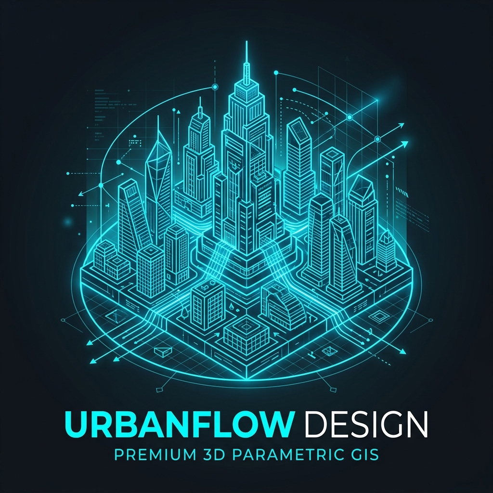

# PlanX Urban Procedural 3D

**Parametric 3D zoning lab for QGIS — sculpt setbacks, heights and typologies in a Three.js editor with live compliance feedback.**

---

## Why Urban Procedural 3D?

Testing a zoning scenario usually means modelling in one tool, checking compliance in another, and copying numbers between them. This plugin closes the loop: select parcel/block polygons in QGIS, open a local Three.js cockpit, drag setbacks, heights and typologies — and watch FAR, BCR, GFA and a city-wide PlanX Score update in real time, then sync everything back to the source layer.

## ✨ Features

- **Interactive 3D web cockpit** — live building envelopes, setbacks, roads, pedestrians, traffic, daylight and shadows.
- **8 parametric typologies** — Tower, Slab, Courtyard, L-Shape, U-Shape, Podium Tower, Stepped Tower, Multi-Building Block.
- **Scenario presets** — Balanced Growth, Transit-Oriented Mix, Affordable Mid-Rise, Low-Carbon Campus, Public Realm Upgrade; propagate to all parcels at once.
- **Real-time compliance** — BCR, FAR, height limits, constraint load and PlanX Score evaluated as you drag.
- **Judge-ready heatmaps** — switch parcel colours between score, compliance, density and carbon.
- **Two-way QGIS sync** — write design choices, recalculated footprints, `height_m`/`z_base`/`z_top`, population, carbon, runoff and open-space fields back to the layer.
- **XYZ mass editing in the scene** — drag the Z height handle or X/Y footprint handles directly in 3D.
- **Zero dependencies** — QGIS/PyQt, Python stdlib HTTP server and bundled browser assets; offline demo city if the server is unavailable.

## 🚀 Installation

**From the QGIS Plugin Hub (recommended):** `Plugins → Manage and Install Plugins…` → search for **"PlanX Urban Procedural 3D"** → *Install*.

**From a release zip:** download the latest zip from [Releases](https://github.com/YusufEminoglu/planx_urban_procedural_3d/releases) → `Plugins → Install from ZIP`.

Requires QGIS 3.28 or newer — **QGIS 4 fully supported** — and a modern browser. No external Python dependencies. If the chosen local port is busy, the plugin automatically falls forward to the next free one.

## 📖 Quick start

1. Load a parcel or block polygon layer and select the features to study.
2. Click the **Urban Procedural 3D** toolbar button and choose the layer/port.
3. The local server starts and the 3D cockpit opens in your browser.
4. Adjust typology, setbacks, floors and scenario presets — compliance updates live.
5. Press **Sync to QGIS** to write geometry and planning fields back to the source layer.

Full version history: [CHANGELOG.md](CHANGELOG.md)

## 🧩 Part of the PlanX ecosystem

This plugin is one of 15 open-source QGIS plugins for urban planning by the same author:

| Planning & analysis | CAD & production | 3D & visualization |
|---|---|---|
| [PlanX](https://github.com/YusufEminoglu/PlanX) — spatial-planning suite | [PlanX CAD Toolset](https://github.com/YusufEminoglu/PlanX-CAD) — drafting-grade CAD | [PlanX 3D City](https://github.com/YusufEminoglu/planx_3d_city) — Three.js city viewer |
| [GeoStats Lab](https://github.com/YusufEminoglu/planx_geostats) — spatial statistics | [EasyFillet](https://github.com/YusufEminoglu/EasyFillet) — tangent-arc fillet | [3D OSM Model](https://github.com/YusufEminoglu/osm_3d_model) — OSM → 3D city in browser |
| [Suitability Lab](https://github.com/YusufEminoglu/planx_suitability_lab) — raster MCDA | [Settlement Toolset](https://github.com/YusufEminoglu/PlanX-Settlement) — 9-stage settlement plans | [OSM Quick 3D](https://github.com/YusufEminoglu/osm_quick_3d) — OSM → native QGIS 3D |
| [DataCube Lab](https://github.com/YusufEminoglu/planx_datacube) — spatiotemporal cubes | [UIP Toolset](https://github.com/YusufEminoglu/PlanX-UIP) — Turkish master-plan automation | [Urban Procedural 3D](https://github.com/YusufEminoglu/planx_urban_procedural_3d) — parametric zoning lab |
| [Urban Resilience](https://github.com/YusufEminoglu/planx_urban_resilience) — 28 resilience tools | [ParcelFlux](https://github.com/YusufEminoglu/parcelflux) — parcel subdivision | [CartoLab](https://github.com/YusufEminoglu/planx_cartolab) — publication cartography |

## 📜 License & author

GPL-3.0-or-later © [Yusuf Eminoğlu](https://github.com/YusufEminoglu) — bug reports and feature requests welcome in [Issues](https://github.com/YusufEminoglu/planx_urban_procedural_3d/issues).
